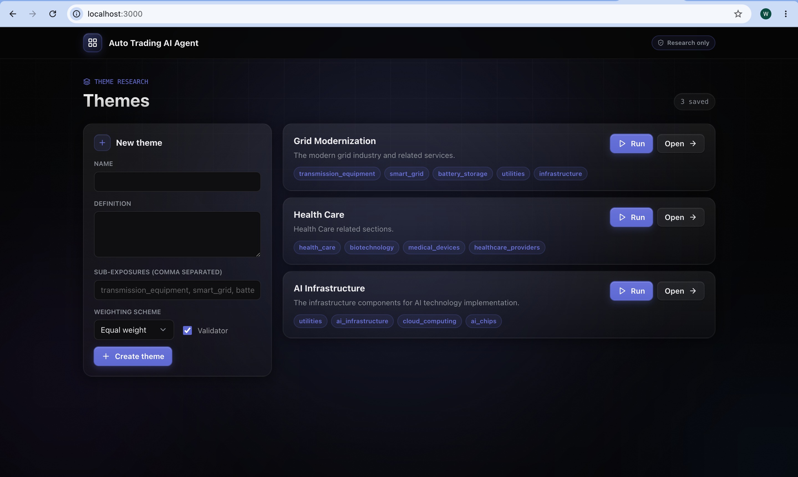
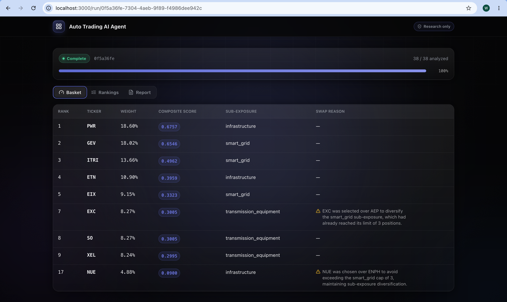
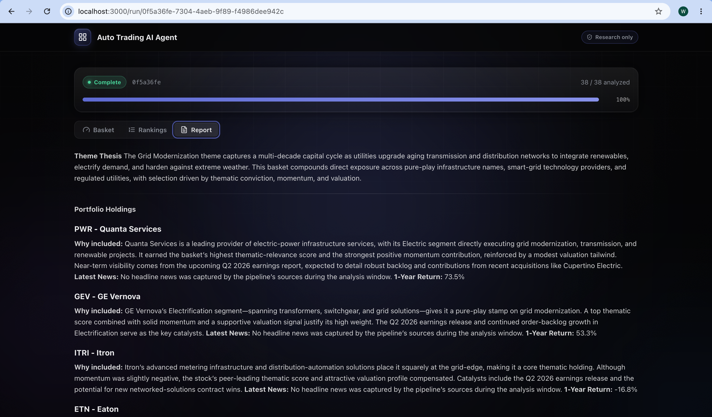

# Theme-to-Execution: How an Agentic AI Platform Is Redefining Thematic Investing for Large Broker-Dealer Advisors

In the high-stakes world of wealth management, financial advisors at large broker-dealers face a familiar bottleneck. A client mentions interest in “AI infrastructure,” “grid modernization,” or “defense tech.” The advisor spends hours screening Morningstar, Bloomberg, and YCharts, manually building a shortlist, navigating firm compliance lists in a separate system, then entering trades account-by-account in the order management system—often missing the market window entirely.

An Automated Trading AI Agent is designed to collapse that cycle from hours into minutes while keeping the advisor firmly in control. This article outlines the market opportunity, product strategy, and technical foundation behind the platform.

### Market Research: The Perfect Storm for Agentic Thematic Tools

Large broker-dealers—wirehouses such as Morgan Stanley Wealth Management, Merrill Lynch/Bank of America, UBS, Wells Fargo Advisors, and scaled platforms like LPL, Ameriprise, Raymond James, and Edward Jones—remain the core channel for mass-affluent through ultra-high-net-worth clients. They sit inside a global wealth ecosystem of roughly $60–130+ trillion in assets under management, with U.S. advised assets continuing to expand amid demographic shifts, market growth, and technology disruption.

McKinsey’s outlook on U.S. wealth management in 2035 highlights four critical shifts that favor specialized agentic solutions:

1. Move from simple automation to orchestration of semi-autonomous agents that collaborate with advisors and back-office teams.  
2. Reinvest productivity gains into innovation rather than pure cost-cutting.  
3. Build AI-fluent, human-centered organizations.  
4. Enable a new archetype of digital-first, AI-native advice delivery that expands access while the best human advisors migrate further upmarket.

Competitive landscape analysis shows existing platforms excel in different slices of the problem. Magnifi (TIFIN) leads in natural-language thematic discovery and research. Vise focuses on hyper-personalized portfolio construction and tax-aware automation. Envestnet provides enterprise-scale insights, next-best-action engines, and workflow integration across planning and reporting (platform assets in the multi-trillion range).

None fully close the loop from client theme request → compliant, ranked basket → multi-account allocation → advisor-approved execution inside the constraints of a large broker-dealer. That gap is the opening.

### Product Strategy: Mission and Value Proposition

**Product Vision**  
A theme-to-execution AI Agent platform purpose-built for financial advisors at large wirehouses and broker-dealers.  

**Positioning Statement**  
For advisors who must respond to client-driven theme requests with specific, timely, compliant trades, the Automated Trading Agent translates a theme into ready-to-execute trade baskets across client portfolios in minutes—unlike fragmented research tools and OMS platforms that leave advisors stuck between hours of manual work and missed market windows.

**Product Mission**  
Accelerate value-generation speed with compliant decision-making through four tightly linked capabilities:

1. **Theme Classifier** – NLP engine that maps a keyword or phrase to a ranked basket of 8–12 securities, each with confidence scores and human-readable rationales.  
2. **Real-time Compliance Overlay** – Inline green/yellow/red flags evaluated against firm-specific rules, with drill-downs and auto-replacement suggestions—no separate portal.  
3. **Intelligent Allocation Rules** – Per-account distribution (equal weight, risk-adjusted, tax-aware) that respects individual constraints and produces a structured trade list.  
4. **Advisor-in-the-Loop Execution** – Unified review dashboard with full edit capability, version tracking, client-ready exports, and an explicit approval gate before any OMS hand-off.

**Value Proposition**  
For large broker-dealer advisors who need to respond quickly and compliantly to thematic interest, the Agent delivers a purpose-built, advisor-controlled workflow that turns a theme keyword into a ready-to-execute, multi-account portfolio in minutes—without sacrificing oversight or regulatory discipline.

Differentiation is deliberate:

- Versus Magnifi/TIFIN: stronger compliance visibility and multi-account bulk execution.  
- Versus Vise: more specialized for rapid thematic idea generation and explicit compliance flagging with a lighter, advisor-controlled workflow.  
- Versus Envestnet/Aladdin: complements rather than replaces—acting as a fast thematic front-end that can feed existing enterprise systems.  
- Versus internal wirehouse tools: more modern NLP theme classification and true multi-account allocation logic in a unified view.

Measurable success criteria move from early product-market fit (50 active advisor seats, 10 teams, ≥60% weekly active rate, ≥50 distinct themes) to full-market stage targets ($500M AUM influenced, ≥85% time reduction per basket, ≥85% compliance first-pass rate, ≥60% basket-to-execution conversion, $80M ARR).

### Product Development: Technical Foundation

The system is deliberately scoped as research-and-proposal, not live order placement. Given a theme (e.g., “grid modernization”), it screens a candidate universe, analyzes each name, scores and ranks with a transparent quantitative model, constructs a constrained 5–10 name basket, and produces a written rationale. Runs are on-demand only.

  

  

  

**Technical Stack (tiered)**  
- **User Interface**: Next.js 16 + FastAPI.  
- **Agentic Design**: LangChain / LangGraph for orchestration, Langfuse for tracing, OpenAI / DeepSeek / ZHIPU models, PostgreSQL + Redis + Pinecone for data and memory.  
- **Infrastructure**: Docker, PostgreSQL, Redis, Celery task queue.  

Cloud deployment centers on Azure (Static Web Apps + Front Door, API Management, AKS, Azure OpenAI, AI Search, Cosmos DB, Blob Storage, Monitor + Application Insights, DevOps with Bicep/Terraform), keeping data inside Azure boundaries.

**Multi-Agent Orchestration (LangGraph)**  
Five specialized agents form a clear pipeline:

1. **Screener Agent** – Decomposes the theme into 3–6 sub-exposures, pulls verifiable tickers from thematic ETFs, GICS, and index membership (50–150 candidates), flags liquidity/market-cap issues.  
2. **Analyst Agent** (parallel) – Produces grounded, source-cited qualitative reports and structured scores for each ticker.  
3. **Modeling Agent** – Deterministic factor scoring (thematic fit, valuation, growth, quality, momentum, sentiment), z-score normalization, weighted-sum or Borda rank aggregation, and final ranking.  
4. **Trader Agent** – Constructs the 8–10 name basket with weights and hard constraints (sector caps, liquidity floors).  
5. **Report Agent** – Generates the investment rationale document from theme definition, analyst reports, and factor breakdowns.

Prompt engineering emphasizes narrow role framing, explicit numbered procedures, grounding/anti-hallucination constraints, and negative instructions that prevent agents from drifting into each other’s responsibilities.

**Evaluation Framework (three levels)**  
- **Deterministic components** (Modeling, Trader): unit tests, property tests (monotonicity, valid ranks), and constraint verification.  
- **LLM-driven components** (Screener, Analyst, Report): golden-set coverage against known ETF holdings, basket-plausibility overlap checks, and groundedness verification against Langfuse traces and source tool calls.  
- **System-level**: shadow-mode weight testing (no re-fetch or LLM calls), forward-looking performance tracking versus the theme’s reference ETF, and a mandatory human review gate before any client-facing output.

### Looking Ahead

The product roadmap prioritizes Theme Classifier and Compliance Overlay (high priority, 3–6 months), followed by Smart Allocation and Advisor-in-the-Loop capabilities. The explicit project timeline runs from Q4 2026 through Q3 2027, with clear feature epics and configurability for firm-specific rules, allocation policies, and audit requirements.

By combining specialized multi-agent orchestration, transparent quantitative ranking, real-time compliance, and strict advisor control, the Automated Trading AI Agent turns thematic requests from a time sink into a competitive advantage. Advisors regain hours, clients receive timely and explainable exposure, and firms gain a supervised, auditable path into the agentic future of wealth management.

The window for thematic opportunity is short. The tools that close it—while respecting the realities of large broker-dealer supervision—will define the next decade of advisor productivity.

**Git Repo: https://github.com/wenyuliuinfo/auto-trading-ai-agent**
