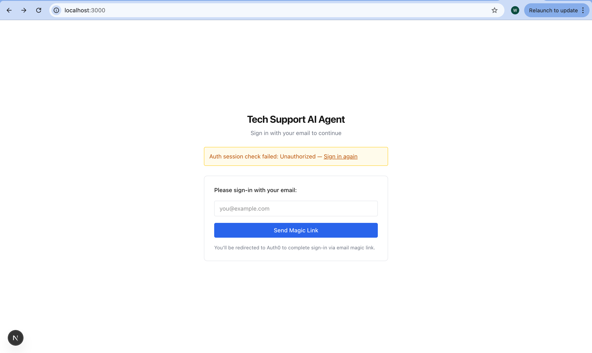
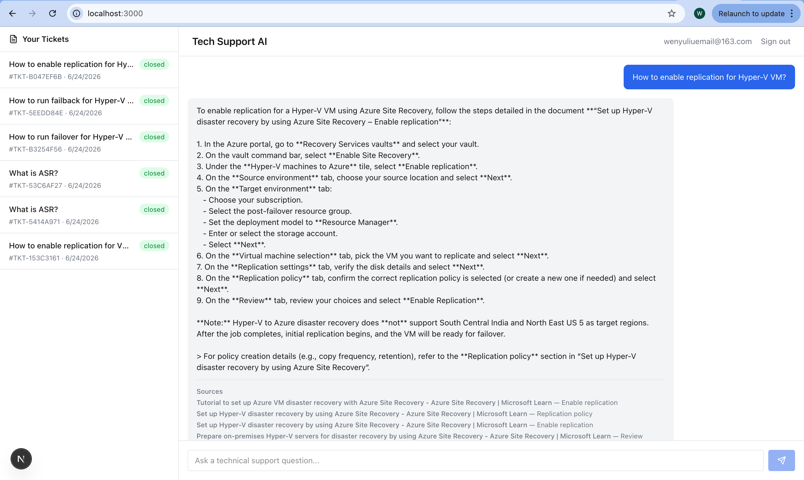

# Introducing the Tech Support AI Agent for Azure Site Recovery & Azure Migrate

Technical support for complex cloud services like Azure Site Recovery (ASR) and Azure Migrate has long been a bottleneck. Operation engineers, solution architects, and first-time product trial users open tickets with questions ranging from “How do I safely delete a Recovery Services vault after failover?” to error messages during test failover or high-level migration architecture guidance. Today those requests land in a shared human queue. First response times stretch, the same issues get solved repeatedly by different engineers, and each new agent lacks the user’s historical context.

The Tech Support AI Agent is built to change that. It delivers grounded, cited answers in seconds for fundamental questions and standard operational procedures—while seamlessly escalating the harder cases and preserving full account history. This article covers the market need, product strategy, and the technical foundation (including the RAG system and evaluation approach) that make it possible.

### Market Research: The Persistent Friction in Enterprise Cloud Support

Azure Site Recovery and Azure Migrate sit at the center of business-continuity and cloud-migration workloads. The users who interact with them—operations engineers running day-to-day failovers, solution architects designing multi-region strategies, and new product trial users—expect fast, accurate guidance. Yet the current support model creates four structural pain points:

1. **Long first-response times** – Every ticket routes into a human backend pool.
2. **High request variation** – Questions span product fundamentals, step-by-step procedures, error diagnostics, and architectural design.
3. **Repeated work** – Multiple engineers independently research and answer the same recurring issues.
4. **Lost context** – Successive tickets for the same account are handled by different people who lack prior resolutions and preferences.

These frictions directly affect customer satisfaction, operational cost, and the speed at which customers adopt and expand Azure services. Industry pressure is intensifying: enterprises demand sub-minute answers for routine questions while reserving human expertise for novel or high-stakes scenarios. Support organizations that cannot deliver both speed and accuracy risk higher churn and escalating ticket volumes.

The opportunity is clear. An AI agent that reliably answers the high-volume, well-documented questions (fundamentals and standard procedures) can cut first-response time dramatically, raise resolution rates without human intervention, and free senior engineers for the complex architectural and multi-product cases that remain out of scope for the initial release.

### Product Strategy: Mission, Scope, and Measurable Value

**Mission**  
Deliver faster first-time responses, personalized context from past tickets, and higher overall support efficiency for Azure Site Recovery and Azure Migrate users—while keeping answers strictly grounded in official documentation and escalating when confidence is insufficient.

**Target Users & Scenarios**  
- Product trial users seeking cost-safe cleanup steps after failover.  
- Operations engineers troubleshooting test-failover failures.  
- Solution architects designing on-prem VMware-to-Azure migration strategies (in-scope only for foundational guidance; full multi-product architecture remains out of scope).

**Product Scope**  
- Simple fundamental questions about ASR and Azure Migrate.  
- Standard operational procedures (how-to steps drawn from product manuals and internal handbooks). 
- Diagnosis and remediation of specific error codes after procedures have been attempted.  
- Functionality improvements that span multiple Azure products.  
- Full architectural design optimizing performance, cost, and stability across complex environments.

**Core Value & Success Metrics**  
- User value: faster first response, better experience, account-aware answers.  
- Business value: higher satisfaction, greater ticket efficiency, lower operational cost.  

Quantified goals (within three months of launch):
- 50% improvement in first-response time.  
- 30% increase in user satisfaction rate.  

Primary KPIs tracked:
- Resolution Rate (% of conversations fully resolved by the agent without escalation).  
- CSAT (post-chat 1–5 rating).  
- First Response Time (message to first visible token).  
- Average Handle Time.  
- Escalation Rate.

An A/B test plan pits the new web-chat experience against the legacy human-ticket flow (50/50 traffic) with clear launch/rollback criteria based on the core metrics above.

### Product Development: Technical Stack, RAG Pipeline, and Evaluation

**Technical Stack**  
- **Frontend**: Next.js (client-side, Azure-aligned UI).  
- **Backend**: FastAPI + Python for business logic and orchestration.  
- **Vector Database**: Pinecone (document chunks + metadata).  
- **Relational Database**: PostgreSQL (accounts, historical tickets, resolutions).  
- **LLM**: OpenAI GPT-series (streaming completions).  
- **Embeddings**: OpenAI text-embedding-3-large.  
- **Authentication**: External IdP (Auth0/Clerk/Cognito) issuing JWTs that carry `account_id`; tickets are always scoped by the authenticated account.  

  

  

**Online Query Path (real-time RAG)**  
1. User authenticates; session token supplies `account_id`.  
2. Frontend loads the account’s ticket list.  
3. User submits a question (optionally referencing a prior ticket).  
4. Backend retrieves relevant historical tickets from PostgreSQL (keyword match on subject/resolution, filtered by `account_id`).  
5. Query is embedded and sent to Pinecone; top-k chunks are returned with metadata filters.  
6. Prompt is assembled from system instructions + retrieved KB chunks (primary) + optional ticket context (secondary) + user query.  
7. LLM streams tokens back via Server-Sent Events; citations and ticket-context events are interleaved.  
8. Frontend displays the grounded answer with sources.

**Offline Ingestion Path**  
- Knowledge-base documents (Markdown, PDF, DOCX, etc. under `docs/knowledge_base`) are chunked (default 500 tokens, 50-token overlap), embedded, and upserted into Pinecone with rich metadata (`document_id`, `source_path`, `chunk_index`, `title`, `section_heading`, `ingestion_version`, etc.).  
- A scheduled ETL job (hourly) syncs new/updated tickets from the CRM into PostgreSQL.  

**Retrieval Policy**  
Knowledge-base documents are the single source of truth for product and procedural guidance. Ticket context personalizes answers but never overrides current documentation. Retrieval flow: normalize query → top-8 Pinecone chunks → up to 3 relevant tickets → deduplicate → optional re-rank → drop low-confidence results. If no KB chunks pass the relevance threshold, the agent returns a short, honest fallback and suggests escalation or rephrasing. Every non-trivial factual claim must cite at least one KB chunk.

**Evaluation Framework**  
A curated golden set of real support questions drives three layers of measurement:

- **Retrieval quality**: Recall@k, Precision@k, Mean Reciprocal Rank, citation-source match rate.  
- **Answer quality**: groundedness, citation correctness, completeness, hallucination rate, correct refusal when grounding is insufficient.  
- **Operational performance**: p50/p95/p99 latency, embedding and Pinecone query latency, token usage, empty-result rate, streaming completion rate.

Any change to chunking, embeddings, prompting, or retrieval logic must pass the benchmark set before release. Regression on citation correctness or groundedness is a hard blocker.

### Looking Ahead

The initial release focuses on the highest-volume, best-documented questions—fundamentals and standard procedures—delivering measurable gains in response time and satisfaction within three months. Subsequent iterations can expand scope to error diagnosis and richer architectural guidance once the grounding and escalation patterns prove reliable.

By combining a tightly scoped RAG system, account-aware ticket context, strict citation discipline, and continuous evaluation, the Tech Support AI Agent turns routine Azure ASR and Migrate support from a cost center into a scalable, high-quality experience. Customers get answers in seconds; support teams reclaim capacity for the work only humans can do.

The result is simple: faster resolution, lower cost, and happier users—exactly what modern cloud platforms demand.

**Git Repo: https://github.com/wenyuliuinfo/tech-support-ai-agent**